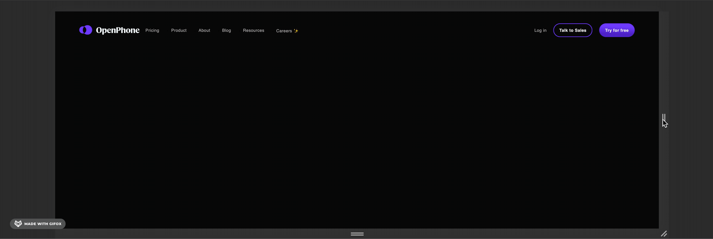

# responsive-nav-bar
A simple responsive navbar that reacts to changes in viewport width. Hamburger menu does not respond to click events as this would require JavaScript. Based on the main navigation found on the [OpenPhone homepage](https://www.openphone.co).

## Source

## My Approach

Layout was achieved by implementing several flexbox containers. The `display` property was used to hide or display elements when necessary. Flex order was changed to have the display order of some containers display differently than the source order, depending on the viewport dimensions.
